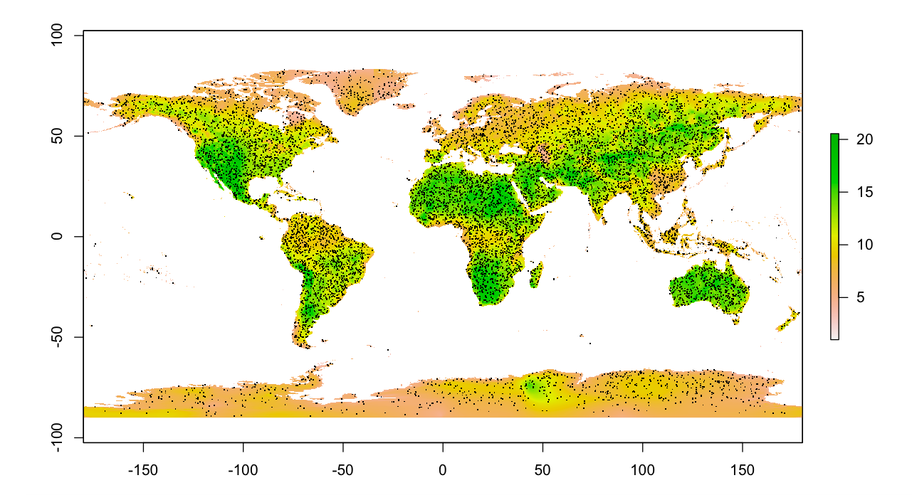
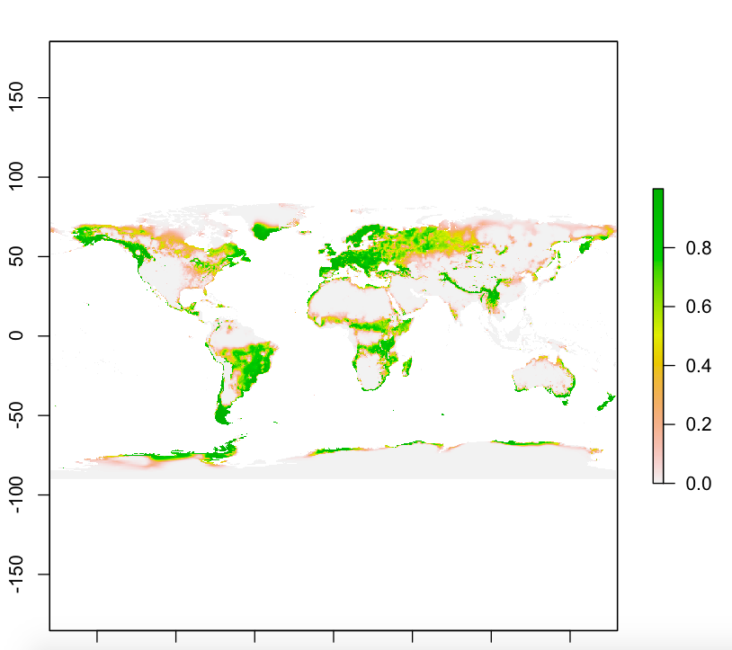
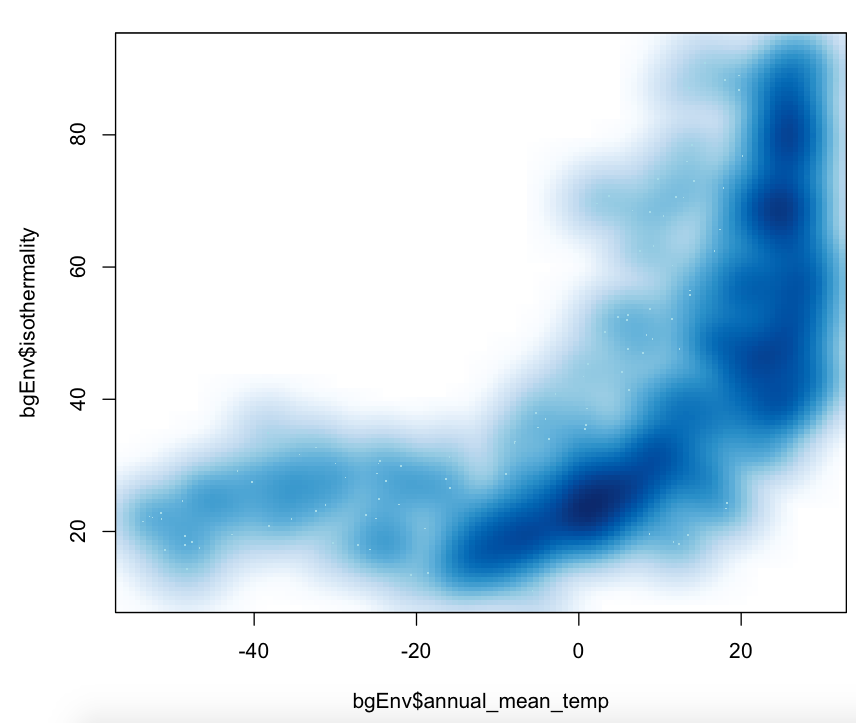

####
*[My Script](lecture_notes/lecture8notes.R)*

```{r setup, include=FALSE}
knitr::opts_chunk$set(echo = TRUE)
```

```{r, echo=FALSE, out.width="50%", fig.cap="Random Distrubution of Points",fig.align='center',R.options="angle=90"}

```

```{r, echo=FALSE, out.width="50%", fig.cap="My location distrubution",fig.align='center',R.options="angle=90"}

```


```{r, echo=FALSE, out.width="50%", fig.cap="Plot of the distrubution of my points",fig.align='center',R.options="angle=90"}

```


```I could not get the points to render in the last graph```


