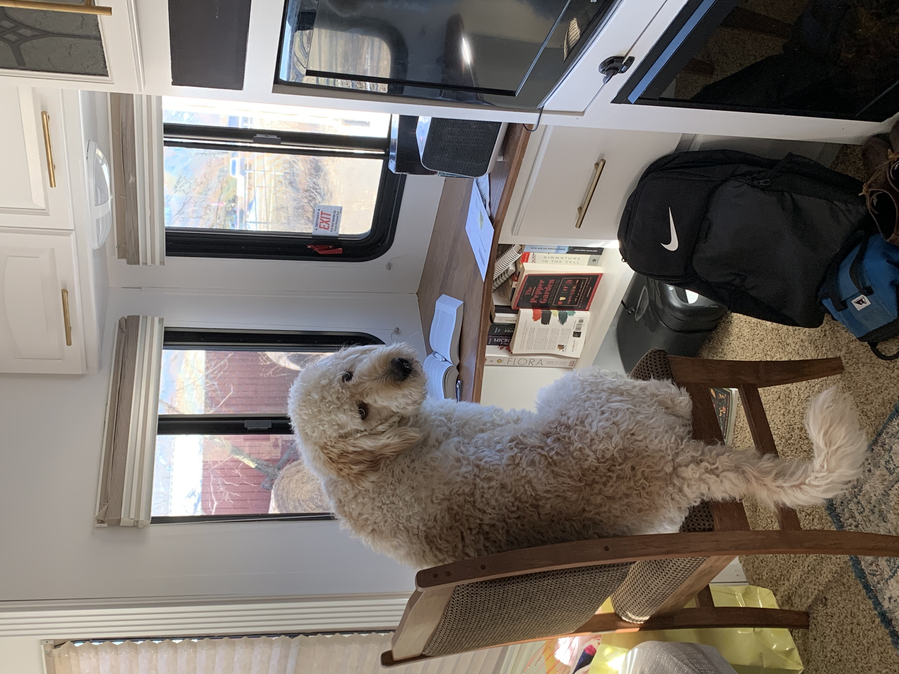

### [Dr. Toomey Class Website](https://mbtoomey.github.io/Biol_7263/)

### [Dr. Ali Lab Website](http://akhtarvirologylab.utulsa.edu/?_ga=2.103113152.1328270510.1662781666-1960873060.1662405509) 

##### About me
Hello! I am a current master's degree student with Dr. Ali. I am married to my beautiful wife B for over 3 years now. We also have an amazing daughter, R, whom we welcomed into this world in March of 2022. We have two doggie friends, Koda (Figure 1) and Hazel (Figure 2). 


```{r, echo=FALSE, out.width="50%", fig.cap="Figure 1 Koda",fig.align='center',R.options="angle=90"}

```

```{r, echo=FALSE, out.width="50%", fig.cap="Figure 2 Hazel",fig.align='center',R.options="angle=90"}
knitr::include_graphics("Koda_2.jpeg")
```

##### Educational Experience
Before my time at TU, I obtained a bachelor's in science in secondary science education with a minor in chemistry from Oklahoma Baptist University [(OBU)](https://www.okbu.edu/). I had originally intended to pursue a career in secondary education, or for those who are unfamiliar, high school/middle school teaching. Throughout my undergraduate studies I was increasingly more intrigued by graduate studies. I had a earnest passion for plant studies and wanted to couple that passion with pathology. Hence, I stumbled upon the field of plant pathology.

##### Research Interests      
I am generally interested in understanding the relationship between a pathological problem (biological) and the plant host effected. I genuinely find all pathogens known to infect plants incredibly interesting, but have grown more interested in virus pathology specifically while at TU under the advising of Dr. Ali. There is much to be elucidated concerning the role of virus infection in various plant hosts. This provides young researchers (like myself) with great opportunities to seek to contribute to a better understanding of these plant-virus interactions. As is related to plant viruses, I am interested in the seed transmissible features of plant viruses (vertical transmission), the ability of viruses to be transmitted within laboratory settings, and plant virus geographical distributions. I greatly enjoy the opportunities I have at TU to study the plant-pathogen interactions, and I hope I will continue to study and contribute to the greater community of science. 


##### Table of Assignments
Date | Description |Assignment
:-----|:------------|:----------
9.10.22 | Rmarkdown 1 | [Assignment 1](Assignments/Assignment1.html)
9.11.22 | Rmarkdown 2 | [Assignment 2](Assignments/practice_lecture2.html)
9.12.22 | Rmarkdown 3 | [Assignment 3]()
9.13.22 | Rmarkdown 4 | [Assignment 4]()


 


 